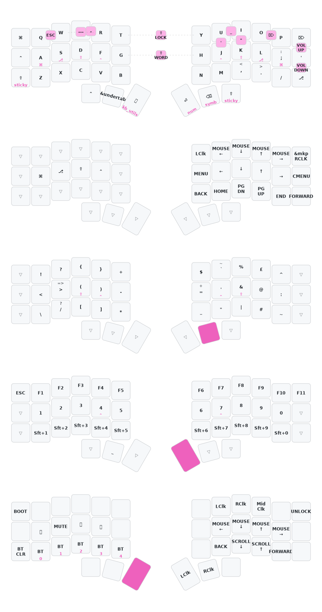

# ZMK Config for my Corne keyboard

Most of this readme is a WIP. 

##

This branch is a copy of the [thrly-corne-zmk](https://github.com/thrly/thrly-corne-zmk/tree/master) layout by thrly. Looked good and figured I'd give it a shot. 

All credits to them. 

## Layout

