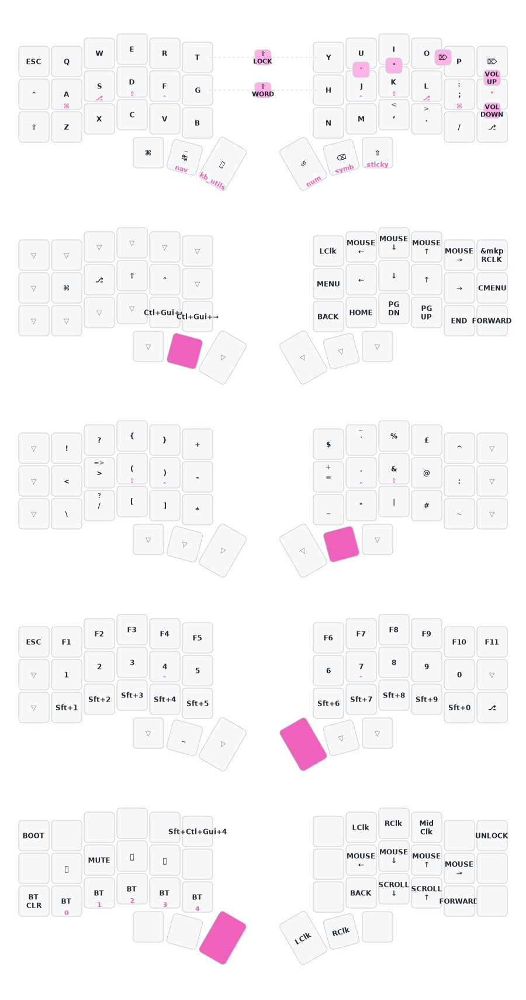

# Corne (42-key)

Split keyboard with nice!nano v2 controllers and nice!view gem displays.

Based on the [thrly-corne-zmk](https://github.com/thrly/thrly-corne-zmk/tree/master) layout by thrly.

## Layout

